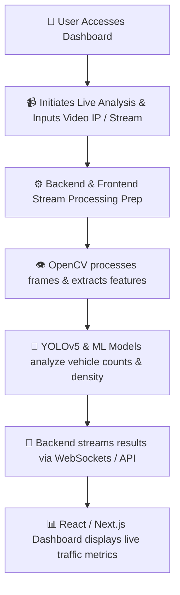

# 🚦 TrafficFlow: Smart Traffic Management System for Urban Congestion

[](https://traffic-flow-peach.vercel.app)
[](https://youtu.be/lBdHk5jTqNU?si=ZhTVLD5dn_nVc4cM)
[](#🏅-smart-india-hackathon-sih-2025-credentials)
[](#-tech-stack)

> [!IMPORTANT]
> ### 🏅 Smart India Hackathon (SIH) 2025 Credentials
> * **Problem Statement ID:** 25050
> * **Problem Statement Title:** Smart Traffic Management System for Urban Congestion
> * **Theme:** Transportation & Logistics
> * **Category:** Software
> * **Team ID:** 77386
> * **Team Name:** **Bitfusion-I**

Our project, **TrafficFlow**, tackles one of the biggest urban challenges: **traffic congestion and emergency vehicle dispatching**. It is an interactive, AI-driven smart traffic management solution designed to replace inflexible fixed-timing traffic signals with real-time adaptive optimization, computer vision analysis, and automatic emergency overrides.

---

## ⚠️ Problem Statement: Smart Traffic Management System for Urban Congestion

Traditional urban infrastructure is struggling to keep pace with rapid urbanization, resulting in severe bottlenecks and inefficiencies:
* ⏳ **Fixed-Timing Signals:** Inflexible, pre-programmed traffic schedules that do not adapt to real-time lane demands.
* 🚗 **Severe Congestion:** Overcrowded roads leading to extensive delays, vehicle bunching, and frustration.
* 🧠 **Lack of Intelligence:** Total absence of smart, automated control systems capable of learning and responding to traffic patterns.
* 🔀 **No Dynamic Re-routing:** Inability to adapt to real-time conditions, road construction, or sudden incidents.
* 🌿 **Environmental Impact:** High carbon footprint, CO2, NOx, and PM2.5 emissions due to unnecessary vehicle idling.
* 👁️ **Poor Visibility:** Limited oversight and tracking metrics for municipal authorities and traffic personnel.
* 📉 **Economic Losses:** High financial setbacks for logistics and commuters due to time and fuel wastage.

---

## 🚀 How It Works (Key Innovations)

The system is split into three core pillars:

1. **🧠 Adaptive Traffic Light Controller (TLC)**
   * **RL (DQN) Model:** Utilizing Deep Q-Networks (DQN) reinforcement learning, the system dynamically adjusts green/red light times based on real-time vehicle queues, cutting commute times and average wait times.
2. **📡 IoT-Based Emergency Vehicle Override (EVSO)**
   * **Priority Routing:** Integrated ESP32 hardware/simulation automatically overrides traffic signals to give green lights to approaching ambulances and emergency vehicles, securing a collision-free corridor.
3. **💻 Web Platform & Dashboard**
   * **Command Center:** A fully functional, responsive admin website built for city authorities featuring live traffic analysis, video feed integrations, emergency dispatching, and manual signal controls.

---

## ⚙️ System Architecture & Data Flow

TrafficFlow operates on a real-time loop, connecting CCTV streams, computer vision models, and an interactive front-end.



### 🔁 Data Processing Flow
1. **Vehicle Detection:** Detects cars, bikes, buses, and trucks in the camera feed using a pretrained **YOLOv5** model.
2. **Vehicle Counting:** Tallies the vehicle numbers on each lane.
3. **Congestion Classification:** Classifies congestion levels as **Low / Medium / High** based on spatial density.
4. **Interactive Dashboard Update:** Real-time metrics are sent directly to the UI for interactive charts, manual override options, and system health status.

---

## 🛡️ Feasibility, Challenges & Strategies

### 🔍 Feasibility Quadrants

```
┌───────────────────────────────────────────┬───────────────────────────────────────────┐
│  🛠️ Technological Feasibility             │  💰 Financial Feasibility                 │
│  - Computer Vision (YOLOv5, OpenCV)       │  - Reduced fuel wastage for commuters     │
│  - Traffic simulators (SUMO, CityFlow)    │  - Lower logistics and supply delays      │
│  - Reinforcement Learning algorithms      │  - Reduced cost of manual traffic monitoring│
├───────────────────────────────────────────┼───────────────────────────────────────────┤
│  ⚙️ Operational Feasibility                │  👥 Social Feasibility                    │
│  - Unified Dashboard for quick override   │  - Public transport prioritization        │
│  - Police & SOS dispatch integration      │  - Green corridors for emergency vehicles │
│  - Special Event and Incident Modes       │  - Promotes Smart City goals & eco-health │
└───────────────────────────────────────────┴───────────────────────────────────────────┘
```

### ⚠️ Challenges & Mitigation Strategies
* **Data Availability:** Solved by leveraging open datasets and synthetic traffic data simulation.
* **Hardware Integration:** Solved by introducing a **Middleware API layer** that adapts to multiple camera vendor protocols.
* **Safety & Fail-Safes:** Handled through **hard-coded safety constraints** at the local controller level to prevent overlapping green signals.
* **Scalability & Cost:** Implemented using a hybrid **Edge and Cloud Computing** framework to balance computation overhead.
* **Regulatory Compliance:** Adhering to legal standards by performing data aggregation (counting/density) only, **without capturing personal identity** (no license plate or facial indexing saved).

---

## 🎯 Real-World Benefits & Impact

### 📈 Proven Impacts So Far (Simulation & Prototypes)
* 🛑 **30% reduction** in traffic congestion.
* ⚡ **35% faster** traffic movement.
* 🚗 **40% less** unnecessary vehicle roaming for parking spots.
* 🌿 Better safety, environmental sustainability, and modern urban planning.

### 🌟 Quadruple-Helix Benefits
* **Environmental:** Lower $CO_2$, $NO_x$, and $PM_{2.5}$ emissions due to less idling and smoother flow. Reduced noise pollution in dense corridors.
* **Economic:** Fuel saving -> direct commuter cost savings. Faster freight transport -> better supply chain reliability. Automated systems -> lower municipal operation costs.
* **Social:** Safer intersections for pedestrians, cyclists, and motorists. Reduced commuter stress. Accessibility-friendly planning.
* **Emergency Services:** Drastic reduction in emergency response times via automated priority corridor dispatching.

---

## 💻 Tech Stack

### Frontend & Dashboard
* **Framework:** Next.js 15, React 18, TypeScript, Tailwind CSS
* **State Management:** Zustand, Redux Toolkit
* **Data Visualizations:** Recharts (high-performance interactive charting)
* **UI Components:** Radix UI primitives & Lucide React icons
* **Communication:** Socket.io client

### Backend & AI Pipelines
* **Core API Server:** Node.js, Express & Flask (Python)
* **AI Orchestration:** Google Genkit (`@genkit-ai/googleai`)
* **Computer Vision:** Python, YOLOv5, OpenCV
* **Mathematical & ML Libs:** NumPy, scikit-learn, TensorFlow, Plotly

### Database & Deployments
* **Databases:** PostgreSQL (via Supabase), MongoDB, Firebase
* **Hosting:** Vercel (Frontend), Nginx / Cloud hosting (Backend)

---

## 👥 Team & Contributions

### **Ayush Bhati**
* **Role:** **Team Leader** & **Lead Frontend Developer** (Problem Statement Solution Group)
* **Key Contributions:**
  * Led and coordinated the development timeline for the SIH 2025 project.
  * Architected and developed the responsive web platform dashboard from scratch.
  * Implemented real-time traffic statistics visualizations (charts & density graphs) using **Recharts**.
  * Integrated **Zustand** state management and web platform overrides for manual city authority interventions.
  * Designed the UX layout for live CCTV streaming, incident alert dashboards, and police dispatch triggers.

---

## 🔮 Future Roadmap

* 📈 **Larger Datasets:** Expand AI training with diverse, real-world multi-city traffic datasets.
* 🔮 **Predictive Analytics:** Build predictive machine learning models to suggest optimal travel times to citizens.
* ☁️ **Cloud Scale:** Scale PMS (Priority Management System) integration across major cities with real-time updates.
* 👁️ **Next-Gen CV:** Incorporate state-of-the-art vision-language models for superior incident detection accuracy.

---

## 🛠️ Getting Started (Local Development)

### Prerequisites
* Node.js v18+
* Python 3.10+ (for backend ML/OpenCV pipeline)

### Installation
1. Clone the repository:
   ```bash
   git clone https://github.com/monkeysoul-cmd/traffic-flow.git
   cd traffic-flow
   ```

2. Install dependencies:
   ```bash
   npm install
   ```

3. Run the development server:
   ```bash
   npm run dev
   ```
   Open [http://localhost:9002](http://localhost:9002) in your browser to view the application.

4. (Optional) Run Genkit Developer UI:
   ```bash
   npm run genkit:dev
   ```
